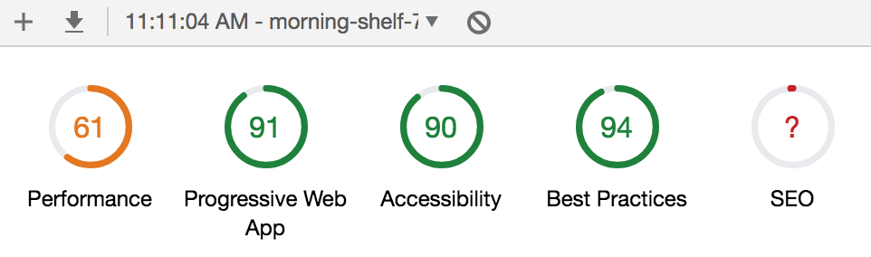

# Intercepting mobile API

I never actually done something like intercepting mobile APIs, so i dove into it with enthusiasm.
Tools like mitmproxy and charles are very easy to use, but i immediately hit  the wall - android 7+ systems don't trust user generated certificates.
So these "man in the middle" tools alone are useless. I educated myself on decompiling/recompiling android app apk and gave it a go.
Took ricardo.ch, extracted apk with apk extractor, decompiled it using apktool and changed network security settings to trust every certificate.
Recompiled and installed modified app on my phone.
And it worked! But, the wall again. Ricardo api is mobile only, so i had to change user-agent header, which makes most XHR libraries throw error that it's unsafe to do so.
Having hacked around that, i soon realized that ricardo api requires an authentication signature that seems to be different with every request.
Figuring out how signature is generated would take too long, if i managed to figure it out at all. So i moved on to tutti.
I tried the same approach with tutti, but realized they have ssl pinning. I tried to find the settings in decompiled apk to disable it, but no luck.
Thinking that finding that setting in a bunch of ugly decompiled code would take too long, i moved on to homegate.
Same story there, unfortunately. But, then it came to me - if i could get my hands on old, pre v7 android phone maybe my problem would be very easily solved.
Found old v5 android, tried tutti, but they have pinning even in that version. Tried homegate, and jackpot!
They only have a simple auth header that doesn't seem to expire.
I'd say this process took me 8-10 hours.

# PWA

Once i got my hands on the API, building PWA was easy.
It's very simple app, with two routes/views - all listings and single listing.
I used create-react-app, since it provides fully PWA compliant boilerplate.
For styling, i used styled-components, the most popular CSS in JS library, which i didn't use before.
It was interesting, although styling didn't move any faster than with classic Sass.
Aside from that, i used the standard tools from react ecosystem - redux, thunk, axios, node/express for serving static assets.
There is room for improvement of course, like advanced PWA features like push notifications, indexedDB for api data caching, etc.
And common performance improvements that i consider to be out of scope of quick prototype project - SEO, HTTP/2, next gen image formats(webP, etc), caching images, better resources compression(gzip), font fallback for slower networks, and so on.
Lighthouse results are not bad:

Estimated time building PWA - 5-6 hours.

# Running/visiting app
If you want to run the app locally, in dev mode, fo this:
- install the app using npm or yarn, ie:

```sh
npm install
```

- run the app in dev env with webpack-dev-server:
 ```sh
 npm run dev
 ```

PWA in production mode is deployed here: https://morning-shelf-76630.herokuapp.com/#/

# API critique

1. List endpoint has entries with a lot more fields than needed for list display, so there is a bit of overfetching.
2. One benefit of list entry and single entry endpoints payload being the same is that you can very simply implement caching.
Ie, when user clicks on single item in list display, you don't need to fetch it, unless user hits the single item by typing in url(bookmarked pages for eg.).
But, these two endpoints, despite having same fields, have mismatches in field names - list has pictures field be array of strings, single has realEstatePictures field with array of objects. Both field contain the same pictures. Also, description vs adDescription, and a couple more of those.
So, i gave up on that kind of caching, because in case i'm using cached data i would have to make the component use different field names that when data is fetched, which is very painful.

